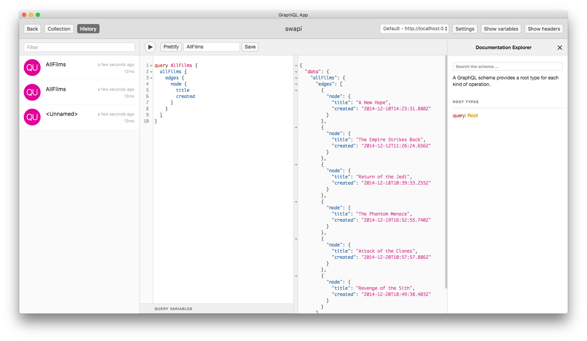
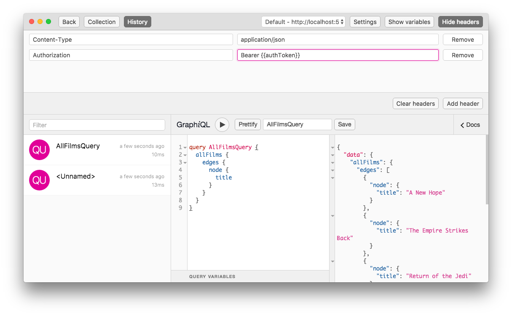
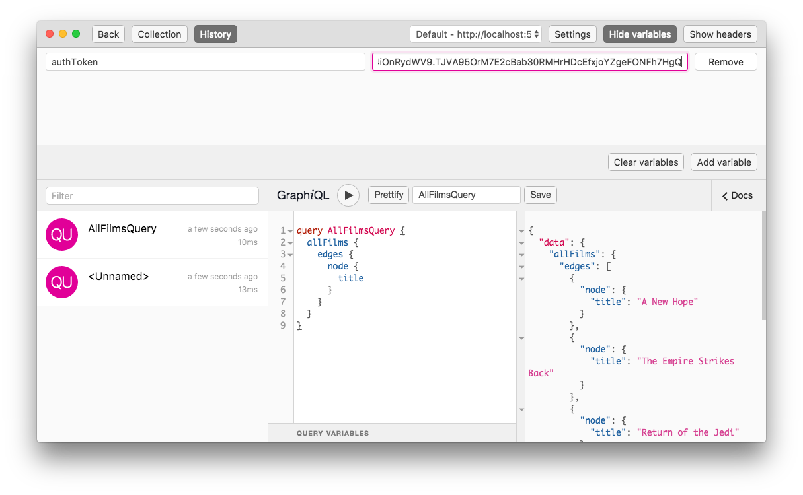
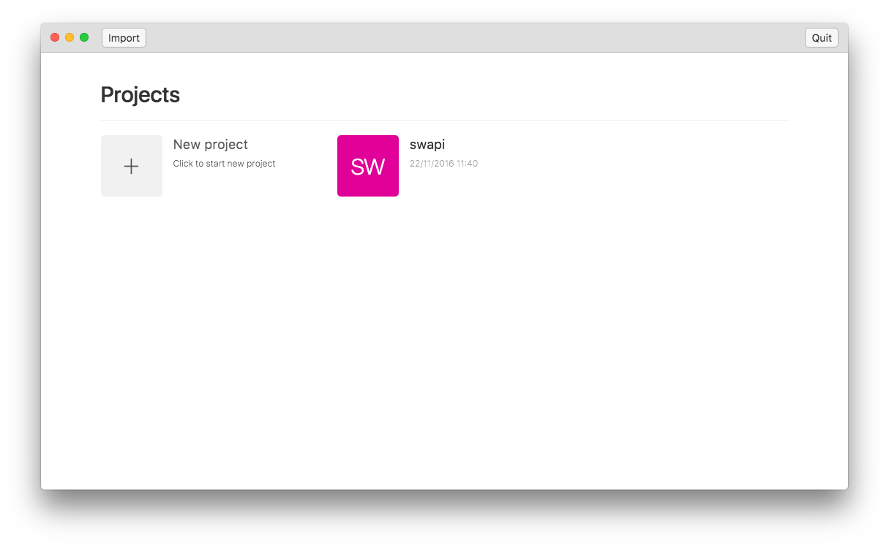

<p align="center">
    
</p>

<p align="center">
  An extensive IDE for exploring GraphQL API's
</p>

---

## Features

- Manage projects
- Import/export
- Store queries
- Query history
- Custom headers
- Environment variables for dynamic headers

## Installing

### MacOS

Unpack the latest app from the [releases][0] tab

### Window / Linux

Releases available soon, for now build the binary using

````
npm install -g electron
npm install
npm run package --all
````

Run the binary using `electron .`

## Upgrade from 0.x

Download the latest 0.2.x version, this will give you an option to export any project for 1.x.
After you've installed 1.x you can import the project there. You can always go back to 0.x, your project data is stored at
`/Users/[username]/Library/Application Support/graphql-ide`

## Contributing

Please file issues under GitHub, or submit a pull request if you'd like to directly contribute.

## Screenshots

<h3 align="center">
Execute queries
</h3>



<h3 align="center">
Custom headers
</h3>



<h3 align="center">
Environment variables for dynamic headers
</h3>



<h3 align="center">
Manage projects
</h3>



[0]: https://github.com/redound/graphql-ide/releases
